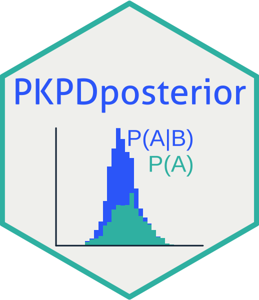

# PKPDposterior 

## Introduction

This software package provides convenience functions around Stan, Torsten, and
PKPDsim. The goal of the package is to make it easier to full-Bayesian inference
in the context of model-informed precision dosing.

The software is intended for use in education and research, and is **not
intended for clinical use**. By design, this package does not include
functionality that directly provides dosing advice.

## Installation and getting started

Install the latest version of PKPDposterior using remotes or devtools:

``` r
remotes::install_github("InsightRX/PKPDposterior")
devtools::install_github("InsightRX/PKPDposterior")
```

PKPDposterior depends on Torsten and Stan. If you don't already have these 
software working, follow the instructions for installing 
[Torsten](https://github.com/metrumresearchgroup/Torsten). Then, add the file
path to your Stan installation location to your environment variables.

```r
Sys.setenv(STAN_PATH = "path/to/stan")
```

To avoid running the above command every time you restart your R session, 
consider adding this environment variable to your .Rprofile or other 
configuration file.

Prepare your R session to use Stan by running the following line of code:

```r
cmdstanr::set_cmdstan_path(
    path = file.path(Sys.getenv("STAN_PATH"), "cmdstan")
)
```

Great! Now you should be all ready to start modeling!

## Model syntax

For structured analysis in PKPDposterior it is required to write your
Stan/Torsten models using standardized syntax. The following variables are
recognized, with their approximate equivalent in NONMEM, if available:

| Variable name | Meaning | NONMEM equivalent |
| --- | --- | --- |
| `dv` | Vector of observed values | `DV` column in input |
| `ipred` | Vector of predicted values for all event times | `IPRED` column in output |
| `ipred_obs` | Vector of predicted values for observation records only | `IPRED` column in output for records where `EVID==0` |
| `ipred_ruv` | Vector of predicted values for observation records only, with residual variability simulated | `Y` in model file, `DV` in output table |
| `n_t` | Number of event records | Number of rows in input dataset |
| `n_cmt` | Number of compartments | |
| `n_obs` | Number of observations | Number of rows in input dataset with `EVID==0` | 
| `i_obs` | Index of observation records within all event records | |
| `theta` | Vector of model parameters | `$THETA` (although not same data format) |
| `ode` | Function for the ODE system | `$ODE` |
| `A` | Vector of amounts in compartments | `A` in model file |
| `dAdt` | Vector of gradients for ODE system | `DADT` in model file |
| `prior_<parameter>` | Samples of prior parameter distribution | |

For models with more than one observation type, such as PK-PD models, or a
parent-metabolite model, the variables related to observations (i.e. in the
first 8 rows) should be appended with a tag for the respective observation type,
e.g. `dv_pk` and `dv_pd`, or `dv_parent` and `dv_metab`, etc. See the
neutropenia model for an example.

## Contributing

We welcome input from the community:

- If you think you have encountered a bug, please [submit an issue](https://github.com/InsightRX/PKPDposterior/issues) 
on the GitHub page. Please include a reproducible example of the unexpected 
behavior.

- Please [open a pull request](https://github.com/InsightRX/PKPDposterior/pulls) if
you have a fix or updates that would improve the package. If you're not sure if
your proposed changes are useful or within scope of the package, feel free to
contact one of the authors of this package.

## Disclaimer

The functionality in this R package is provided "as is". While its authors 
adhere to software development best practices, the software may still contain 
unintended errors.

InsightRX Inc. and the authors of this package can not be held liable for any
damages resulting from any use of this software. By the use of this software 
package, the user waives all warranties, expressed or implied, including any 
warranties to the accuracy, quality or suitability of InsightRX for any 
particular purpose, either medical or non-medical.


<div align="right">
© 
</div>
